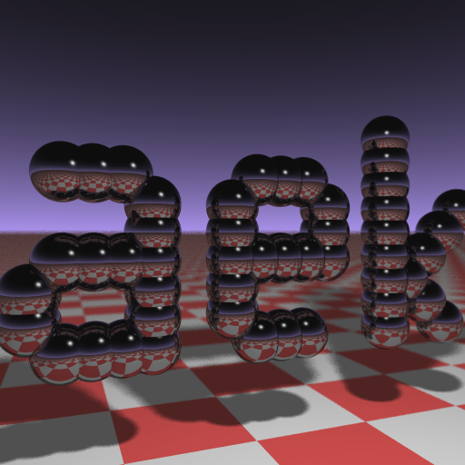

# BUSINESS CARD RAYTRACER

This is the source code analysis and refactoring of Andrew Kensler's famous `Business Card Raytracer`.



## PREAMBLE

The `Business Card Raytracer` is a complete raytracer written in C++ by Andrew Kensler, whose source code can be printed on a standard business card.

The original minified code is just made of **1337 bytes**... the [leet](https://en.wikipedia.org/wiki/Leet) word!

This code was originally written for the famous challenge proposed by Paul Heckbert on `comp.graphics` which started on May 4th, 1984, the [Star Wars Day](https://en.wikipedia.org/wiki/Star_Wars_Day)... May the 4th be with you!

The raytracer has these features:

  - The logo is made of spheres.
  - There is a sky with a smooth gradient.
  - There is a floor with a checkerboard texture.
  - Shadows are simulated and are soft shadows.
  - Depth of field is simulated for a realistic distance blur.
  - Each pixel of the scene is randomly multi-sampled (stochastic sampling).
  - The output file format is the `ppm` format (Portable PixMap).

The code is written in C++ and requires a C++14 compliant compiler from the refactored versions.

Here is the original minified source code:

```
#include <stdlib.h>   // card > aek.ppm
#include <stdio.h>
#include <math.h>
typedef int i;typedef float f;struct v{
f x,y,z;v operator+(v r){return v(x+r.x
,y+r.y,z+r.z);}v operator*(f r){return
v(x*r,y*r,z*r);}f operator%(v r){return
x*r.x+y*r.y+z*r.z;}v(){}v operator^(v r
){return v(y*r.z-z*r.y,z*r.x-x*r.z,x*r.
y-y*r.x);}v(f a,f b,f c){x=a;y=b;z=c;}v
operator!(){return*this*(1/sqrt(*this%*
this));}};i G[]={247570,280596,280600,
249748,18578,18577,231184,16,16};f R(){
return(f)rand()/RAND_MAX;}i T(v o,v d,f
&t,v&n){t=1e9;i m=0;f p=-o.z/d.z;if(.01
<p)t=p,n=v(0,0,1),m=1;for(i k=19;k--;)
for(i j=9;j--;)if(G[j]&1<<k){v p=o+v(-k
,0,-j-4);f b=p%d,c=p%p-1,q=b*b-c;if(q>0
){f s=-b-sqrt(q);if(s<t&&s>.01)t=s,n=!(
p+d*t),m=2;}}return m;}v S(v o,v d){f t
;v n;i m=T(o,d,t,n);if(!m)return v(.7,
.6,1)*pow(1-d.z,4);v h=o+d*t,l=!(v(9+R(
),9+R(),16)+h*-1),r=d+n*(n%d*-2);f b=l%
n;if(b<0||T(h,l,t,n))b=0;f p=pow(l%r*(b
>0),99);if(m&1){h=h*.2;return((i)(ceil(
h.x)+ceil(h.y))&1?v(3,1,1):v(3,3,3))*(b
*.2+.1);}return v(p,p,p)+S(h,r)*.5;}i
main(){printf("P6 512 512 255 ");v g=!v
(-6,-16,0),a=!(v(0,0,1)^g)*.002,b=!(g^a
)*.002,c=(a+b)*-256+g;for(i y=512;y--;)
for(i x=512;x--;){v p(13,13,13);for(i r
=64;r--;){v t=a*(R()-.5)*99+b*(R()-.5)*
99;p=S(v(17,16,8)+t,!(t*-1+(a*(R()+x)+b
*(y+R())+c)*16))*3.5+p;}printf("%c%c%c"
,(i)p.x,(i)p.y,(i)p.z);}}
```

## SOURCES

The source code is available into the `src` directory.

  - `src/00_original/`: the original minified source code.
  - `src/01_formatted/`: the original formatted source code.
  - `src/02_refactored/`: the original formatted and refactored source code.
  - `src/03_rewritten/`: the refactored and rewritten source code.

The formatted version was generated with `llvm-format` and some very minor manual editing.

## HOW TO BUILD

Each version provides a `Makefile` which can be used to build and/or clean the program.

The toplevel `Makefile` can be used to build and/or clean all the versions available in the `src` directory.

### BUILD

```
make
```

or

```
make all
```

### CLEAN

```
make clean
```

## HOW TO RUN

### ORIGINAL VERSIONS

You just have to run the generated program and redirect the standard output to a file.

Example:

```
./card.bin > card.ppm
```

### REFACTORED VERSIONS

You just have to run the generated program. The generated image is by default written in a file named `card.ppm`.

Some options are available on the command-line. Add `--help` to display the available options.

```
Usage: card.bin [OPTIONS...]

The Business Card Raytracer

Options:

    --help                  display this help
    --output={path}         the output filename
    --width={int}           the card width
    --height={int}          the card height

```

The following example will generate a file named `card.ppm`:

```
./card.bin
```

The following example will generate a file named `output.ppm`:

```
./card.bin --output=output.ppm
```

### REWRITTEN VERSION

The `rewritten` version is quite like the `refactored` version but with the code heavily refactored, rewritten with a full POO approach and modern C++ features.

The code is more or less 20%~30% faster and the renderer supports colored ambient lighting, colored light with attenuation, etc...

Before:


After:


Another example:


## REFERENCES

Andrew Kensler:

  - [Original source code](https://web.archive.org/web/20150722052342/http://www.cs.utah.edu/~aek/code/card.cpp)
  - [Business Card Ray Tracer](http://eastfarthing.com/blog/2016-01-12-card/)

Fabien Sanglard:

  - [Decyphering the Business Card Raytracer](https://fabiensanglard.net/rayTracing_back_of_business_card/)

Paul Heckbert:

  - [Home page](http://www.cs.cmu.edu/~ph/)
