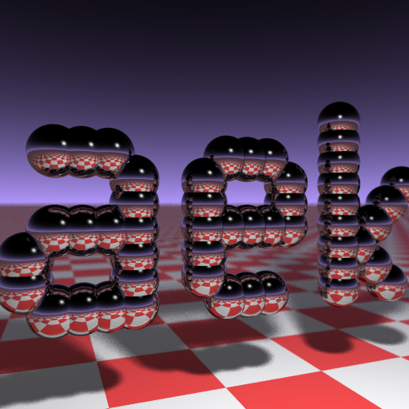

# BUSINESS CARD RAYTRACER

This is the refactored source code of Andrew Kensler's famous `Business Card Raytracer`.

This basically the original source code fully refactored and rewritten for better readibility, better performances, better and more real lighting, etc...



## BUILD

```
make
```

or

```
make all
```

## CLEAN

```
make clean
```

## RUN

```
make run
```

The output image is named `card.ppm`.

You can also run the generated program and the generated image is written by default in a file named `card.ppm`.

Some options are available on the command-line. Add `--help` to display the available options.

```
Usage: card.bin [OPTIONS...]

The Business Card Raytracer

Options:

    --help                  display this help
    --output={path}         the output filename
    --scene={scene}         the scene to render
    --width={int}           the card width
    --height={int}          the card height
    --samples={int}         samples per pixel
    --recursions={int}      maximum recursions level

Scenes:

    - aek
    - ponceto
    - smiley
    - simple

```

The following example will generate a file named `card.ppm`:

```
./card.bin
```

The following example will generate a file named `output.ppm`:

```
./card.bin --output=output.ppm
```

## EXAMPLES

### AEK

```
./card.bin --scene=aek --width=960 --height=540 --samples=256 --output=aek.ppm
```


### PONCETO

```
./card.bin --scene=ponceto --width=960 --height=540 --samples=256 --output=ponceto.ppm
```


### SMILEY

```
./card.bin --scene=smiley --width=960 --height=540 --samples=256 --output=smiley.ppm
```


### SIMPLE

```
./card.bin --scene=simple --width=960 --height=540 --samples=256 --output=simple.ppm
```


