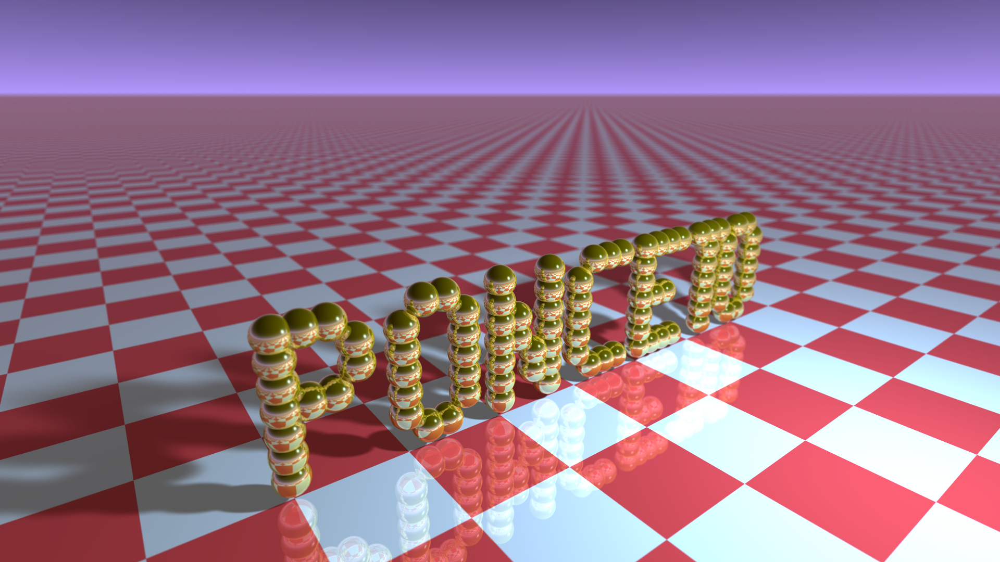

# BUSINESS CARD RAYTRACER

This is the refactored source code of Andrew Kensler's famous `Business Card Raytracer`.

This basically the original source code fully refactored and rewritten for better readibility, better performances, better and more real lighting, etc...

## BUILD

```
make
```

or

```
make all
```

## CLEAN

```
make clean
```

## RUN

```
make run
```

The output image is named `card.ppm`.

You can also run the generated program and the generated image is written by default in a file named `card.ppm`.

Some options are available on the command-line. Add `--help` to display the available options.

```
Usage: card.bin [OPTIONS...]

The Business Card Raytracer

Options:

    --help                  display this help
    --output={path}         the output filename
    --scene={scene}         the scene to render
    --width={int}           the card width
    --height={int}          the card height
    --samples={int}         samples per pixel
    --recursions={int}      maximum recursions level

Scenes:

    - aek
    - ponceto
    - smiley
    - simple
    - spheres

```

The following example will generate a file named `card.ppm`:

```
./card.bin
```

The following example will generate a file named `output.ppm`:

```
./card.bin --output=output.ppm
```

## EXAMPLES

### AEK

```
./card.bin --scene=aek --width=1920 --height=1080 --samples=1024 --output=aek.ppm
```


### PONCETO

```
./card.bin --scene=ponceto --width=1920 --height=1080 --samples=1024 --output=ponceto.ppm
```



### SMILEY

```
./card.bin --scene=smiley --width=1920 --height=1080 --samples=1024 --output=smiley.ppm
```


### SIMPLE

```
./card.bin --scene=simple --width=1920 --height=1080 --samples=1024 --output=simple.ppm
```


### SPHERES

```
./card.bin --scene=spheres --width=1920 --height=1080 --samples=1024 --output=spheres.ppm
```


## TESTING

You can also use `render-all.sh` script to render all scenes while specifying resolution and quality.

```
Usage: render-all.sh [ARGUMENTS...]

Arguments:

    help, --help            display this help

    default                 resolution of 512x512, 64 samples per pixel

    tiny                    set resolution to 384x216
    small                   set resolution to 480x270
    medium                  set resolution to 960x540
    large                   set resolution to 1440x810
    huge                    set resolution to 1920x1080

    q8                      set quality to 8 samples per pixel
    q16                     set quality to 16 samples per pixel
    q32                     set quality to 32 samples per pixel
    q64                     set quality to 64 samples per pixel
    q128                    set quality to 128 samples per pixel
    q256                    set quality to 256 samples per pixel
    q512                    set quality to 512 samples per pixel
    q1024                   set quality to 1024 samples per pixel

```

Example: render all scenes at the lower resolution/quality.

```
./render-all.sh tiny q8
```

Example: render all scenes at the higher resolution/quality.

```
./render-all.sh huge q1024
```
